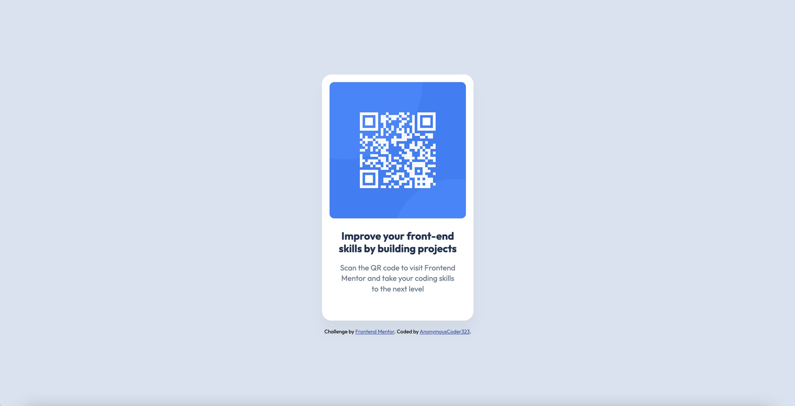

# Frontend Mentor - QR code component solution

This is a solution to the [QR code component challenge on Frontend Mentor](https://www.frontendmentor.io/challenges/qr-code-component-iux_sIO_H). Frontend Mentor challenges help you improve your coding skills by building realistic projects. 

## Table of contents

- [Overview](#overview)
  - [Screenshot](#screenshot)
  - [Links](#links)
- [My process](#my-process)
  - [Built with](#built-with)
- [Author](#author)

## Overview

### Screenshot

### Links

- [Solution](https://www.frontendmentor.io/solutions/responsive-page-using-flexbox-and-grid-E_1A_f2EQ-)
- [Live Site](https://anonymouscoder323.github.io/qr-code-component-main/)

## My process

### Built with

- Semantic HTML5 markup
- CSS custom properties
- Flexbox
- CSS Grid
- Mobile-first workflow

## Author

- Website - [Anonymous Coder](https://anonymouscoder.com/)
- Frontend Mentor - [@AnonymousCoder323](https://www.frontendmentor.io/profile/AnonymousCoder323)